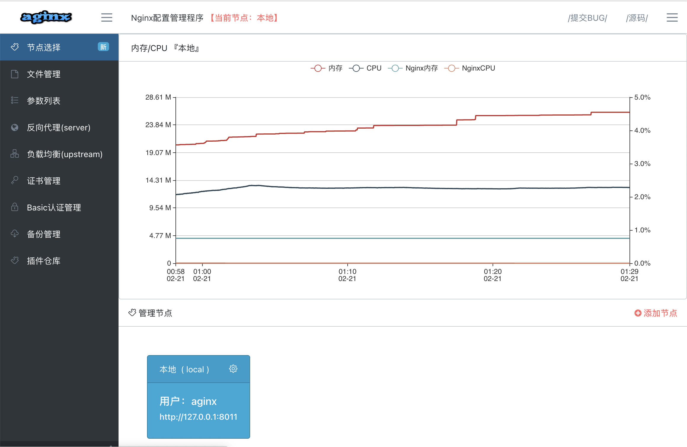
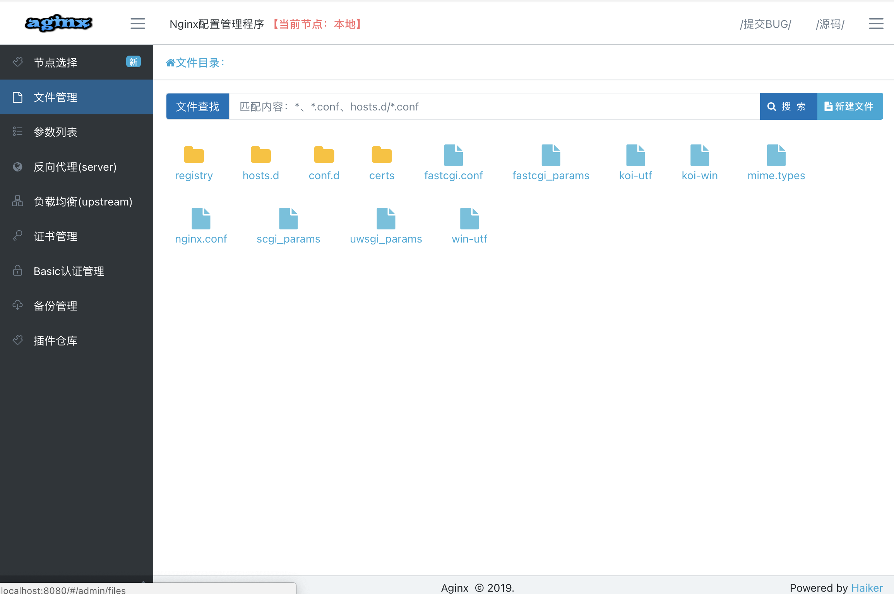
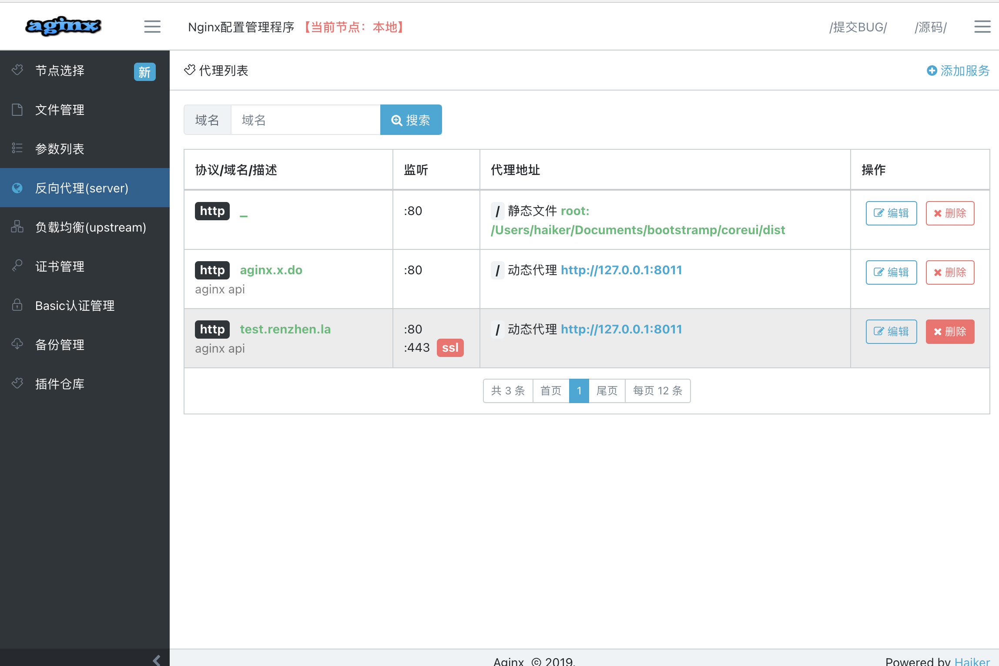

# Aginx 

Add management API service for [nginx][NGINX]

[![Try in PWD][PWDIMAGE]][PWD]

## Feature

- [X] Web console to manager nginx.
- [X] restful api SDK for aginx
- [X] Obtain a free SSL certificate and configure it.
- [X] Configure nginx with consul k/v, etcd k/v , zookeeper.
- [X] Publish `docker` service to NGINX configuration.
- [X] Publish `consul` service to NGINX configuration.

## Software screenshot

## [Installation](./docs/INSTALL.MD)

## [Usage](./docs/USAGE.MD)

## Contribution

- If you encounter a bug, you can submit it to the dev branch directly.
- If you encounter a problem, you can feedback through the issue.
- The project is under development, and there is still a lot of room for improvement. If you can contribute code, please submit PR to the dev branch.
- If there is feedback on new features, you can feedback via issues or qq group , dingtalk group.

## Technical support

[NGINX]: http://nginx.org
[PWDIMAGE]: https://raw.githubusercontent.com/play-with-docker/stacks/master/assets/images/button.png "Play With Docker Image"
[PWD]: https://labs.play-with-docker.com/?stack=https://raw.githubusercontent.com/ihaiker/aginx/master/demo/docker-compose.yml "Docker Stack YAML"
